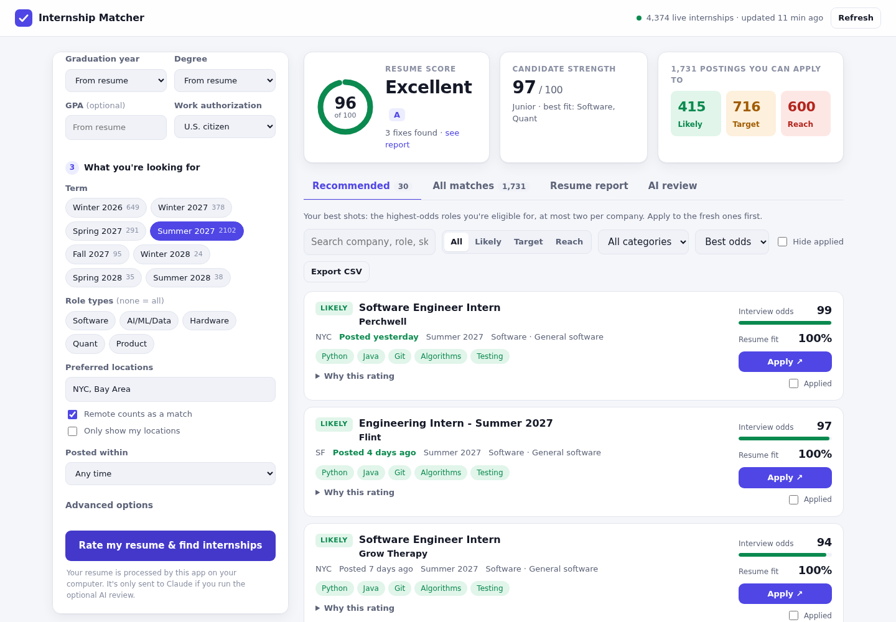
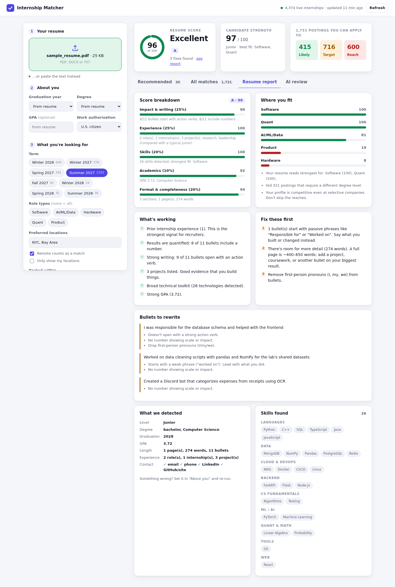

# Internship Matcher: Pre-Law · Business · Humanities

Upload your resume and get three things back:

1. **A resume score** (0–100 with a letter grade) from a transparent rubric built for pre-law, business and humanities students, plus a prioritized list of specific fixes and the bullets worth rewriting.
2. **A profile rating**: how competitive you are, what year recruiters will read you as, and which track (Pre-Law, Business, Humanities) and areas your resume fits best.
3. **A shortlist of internships you're likely to get interviews for**, pulled from live postings in law and government, finance and consulting, marketing and communications, media and publishing, museums and the arts, education and nonprofits. Each role is rated **Likely**, **Target** or **Reach**, with the reasons, pay, deadline and an apply link.

Found a posting somewhere else (Handshake, LinkedIn, a law firm's site)? **Check a posting** scores any listing you paste in. An optional **AI review** (Claude) adds a recruiter-style critique and bullet rewrites.



## Run it on a Mac

1. Download this repository: **Code › Download ZIP** on GitHub, then double-click the ZIP to unzip it. Or clone it with `git clone https://github.com/ToBeDecided/To-Be-Decided.git`.
2. Open the folder and **double-click `start.command`**.
   - If macOS blocks it ("cannot be opened because it is from an unidentified developer" or "Apple could not verify…"), open **System Settings › Privacy & Security**, scroll down and click **Open Anyway**. On macOS 14 and earlier you can instead right-click `start.command` › **Open** › **Open**. You only need to do this once.
   - Or skip the warning entirely: open **Terminal**, type `bash ` (with a space), drag `start.command` into the Terminal window, and press Return.
3. A Terminal window opens. The first run takes a minute or two to set things up; after that it starts in seconds. Your browser opens to the app automatically.
4. Keep the Terminal window open while you use the app. Close it (or press Ctrl+C) to stop.

You don't need to install Python yourself. macOS comes with Python 3.9, which is too old, so if you don't already have Python 3.10 or newer, the launcher offers to install [uv](https://docs.astral.sh/uv/), a small tool that downloads a private copy of Python for this app. It goes in your home folder and doesn't need an admin password.

Something not working? Run this in Terminal from the app's folder and share the output:

```bash
./start.command --check
```

### Other ways to run it (macOS, Linux, Windows)

With Python 3.10+ installed:

```bash
python3 -m venv .venv
source .venv/bin/activate          # Windows: .venv\Scripts\activate
pip install -e .
internmatch serve                  # opens http://127.0.0.1:8000
```

## Get more internships: free API keys

The app works out of the box with **The Muse**. Two free keys add many more listings. Paste them into **Sources & keys** in the app; they're stored only on your computer.

| Source | Best for | Key |
|---|---|---|
| The Muse | Corporate internships in legal, finance, business, marketing, media, writing and education | None needed |
| **USAJOBS** | Federal internships and Pathways student jobs: DOJ, State Department, Library of Congress, Smithsonian, National Archives and more. **The best source for pre-law, policy, museum and archive roles.** | Free, instant: [developer.usajobs.gov/apirequest](https://developer.usajobs.gov/apirequest/) |
| **Adzuna** | A large aggregator of listings from across the web: legal, finance, consulting, marketing, creative, teaching and nonprofit internships | Free: [developer.adzuna.com/signup](https://developer.adzuna.com/signup) |
| Employer job boards | Every internship at a specific employer that uses Greenhouse, Lever or Ashby | Add `greenhouse:employer` under *Advanced options* |

Postings that are clearly tech, science or healthcare are filtered out so the list stays on-topic.

## How the scoring works

Everything except the optional AI review is deterministic and runs locally, so you can see why you got each number.

### Resume score

| Part | Weight | What it measures |
|---|---|---|
| Impact & writing | 25% | Bullets that open with an action verb (Drafted, Researched, Organized…), show scale with a number (people served, articles written, dollars raised) and run 6–35 words. Penalizes "Responsible for…" and first-person pronouns |
| Experience & involvement | 25% | Internships and jobs, plus the things these fields weigh heavily: leadership positions, mock trial, moot court, debate and Model UN, the campus paper and other publications, research and theses, tutoring, volunteering and study abroad. **Compared with what's typical for your year** |
| Skills & languages | 15% | Recognized skills (Westlaw, LexisNexis, Excel modeling, Bloomberg, Adobe, AP style, archival research, grant writing… ~150 in all), depth in your target area, and foreign languages |
| Academics | 15% | GPA (weighed more heavily when you target law, finance or consulting), honors (Dean's List, honor societies, scholarships) and relevant coursework |
| Format & completeness | 20% | Education first, the key sections, contact details including LinkedIn, one full page, no Objective line, and a portfolio or writing-samples link for media, marketing and arts roles |

### Interview odds

Every posting you're eligible for gets two numbers:

- **Resume fit (0–100%)**: how well your background covers the role. It uses the job description, the skills the title implies (e.g. "Paralegal" → legal research, legal writing, Westlaw/Lexis) and your fit for the posting's area.
- **Interview odds (0–100)**: fit × competitiveness × timing × seniority.
  - *Competitiveness* compares your candidate strength with the employer's selectivity. There are three tiers: standard; highly competitive (e.g. large law firms, Big Four, major newsrooms, federal agencies); and extremely selective (e.g. elite law firms, bulge-bracket banks, MBB consulting, the Met, the Smithsonian, top think tanks). Extremely selective employers are capped, so they're never "Likely" from a cold application.
  - *Timing*: postings from the last few days rank higher, and application deadlines are flagged.
  - *Seniority*: freshmen and sophomores get a boost on programs aimed at them.

Tiers: **Likely** ≥ 70, **Target** 50–69, **Reach** < 50. The **Recommended** list takes the highest-odds roles, fills it with Likely and Target before any Reach, and allows at most two per employer.

Before scoring, postings you can't apply to are hidden and counted: roles for **law students** (1L/2L, summer associate, J.D. candidates) when you're an undergraduate, MBA or PhD roles, high-school programs, visa and citizenship restrictions that apply to you, programs reserved for underclassmen when you're a junior or senior, closed deadlines, and (if you ask) unpaid roles.

> **Treat the odds as a ranking, not a promise.** They're heuristics built from signals recruiters are known to weigh. The app can't see referrals, networking, your school's recruiting pipeline or how many people applied. Use the tiers like a college list: apply to plenty of Likely and Target roles and a handful of Reaches.



## Resume formats

PDF and Word (.docx) work everywhere. On a Mac, older Word (.doc), RTF and OpenDocument files work too, via macOS's built-in `textutil`. For Pages, choose **File › Export To › PDF** first.

## Privacy

- Your resume is parsed on your computer by the local app. The only network calls are downloads of public job listings.
- The app only answers requests from your own computer, and blocks other websites from sending it commands.
- API keys are saved in a settings file only you can read: `~/Library/Application Support/internmatch/config.json` on a Mac.
- The AI review is opt-in, per click, and sends your resume text and top matches to the Anthropic API.

## Command line

```bash
internmatch analyze resume.pdf --track Pre-Law --location DC --location NYC --top 25
internmatch analyze resume.pdf --track Business --paid-only --csv matches.csv
internmatch config set usajobs_email you@school.edu
internmatch config set usajobs_api_key YOUR_KEY
internmatch doctor --verbose       # check setup and whether each job source is reachable
internmatch refresh                # re-download listings now
```

Settings can also come from environment variables: `USAJOBS_API_KEY`, `USAJOBS_EMAIL`, `ADZUNA_APP_ID`, `ADZUNA_APP_KEY`, `ANTHROPIC_API_KEY`, `THEMUSE_API_KEY` (optional), plus `INTERNMATCH_MODEL` (default `claude-opus-5-5`) and `INTERNMATCH_CACHE_DIR`.

## Development

```bash
pip install -e ".[dev]"
pytest
```

The tests run offline: HTTP calls are served by `httpx.MockTransport` and the Claude client is faked. CI runs them on Ubuntu and macOS, and also runs `start.command` on a real macOS runner.

```
start.command   macOS launcher (sets up Python and the app, then starts it)
internmatch/
  resume.py     text extraction (PDF, Word, RTF, Pages) and the resume rubric
  skills.py     skill taxonomy, languages, areas and tracks, title classification and requirements
  matcher.py    eligibility filters, fit, interview odds, tiers, shortlist, paste-a-posting check
  companies.py  employer selectivity tiers
  sources.py    The Muse, USAJOBS, Adzuna, employer boards; caching, pay/term/deadline detection
  config.py     API keys and per-OS folders
  engine.py     end-to-end pipeline used by the web app and CLI
  ai.py         optional Claude review (structured output)
  server.py     FastAPI JSON API + static UI
  static/       single-page web UI (no build step)
tests/          pytest suite with pre-law, business, humanities and weak fixture resumes
```
